# GONE ROGUE - the procedurally generated CLI action fighter

### The year is 1980. Miami is burning, Post-Its just hit the shelves, the MGM is on fire and somebody just shot John Lennon.
### In an unstable world, two buddies sought to create a new world that reflected the turbulence around them.  
### Enter procedural generation, a way of producing 'randomized' worlds from stable rules.  
### This is the world of Rogue, the original Roguelike game that bore an entire genre. 
### It gave gamers something they had never seen before. A game with agency and a life of its own.  
### Now, 40 years later, entropy has flaunted its inescapable will and laid waste to the optimism of the 20th Century.  
### The only cure? Surrendering yourself to endless possibility.  
### How will you fare in the bloody world of GONE ROGUE?  
___
  
[Play *Gone Rogue* here (deployed app)](https://gone-rogue.herokuapp.com/ "Ready to go rogue?")  
[GitHub repository available here](https://github.com/charliehawley/MP3-PyCLI_2)
___

*Gone Rogue* is a command line application game based on the original 1980 *Rogue* game.  
The USP for Rogue and all games in the Roguelike/lite genre is procedural generation -  
typically characterised by randomized elements in the game logic that produce unique   
results each time the game is run.  
*Gone Rogue* follows this standard. Many elements in the game rely on random number  
generation to apply attributes to entities you encounter in-game and even define the  
parameters of the world in which the game takes place.  

## CONTENTS
* [UX](#UX)
    * [USER STORIES](#USER-STORIES)
    * [STRATEGY](#STRATEGY)
    * [SCOPE](#SCOPE)
    * [STRUCTURE](#STRUCTURE)
* [FUTURE FEATURES](#FUTURE-FEATURES)
* [KNOWN BUGS](#KNOWN-BUGS)
* [FIXED BUGS](#FIXED-BUGS)
* [DEPLOYMENT](#DEPLOYMENT)
* [ACKNOWLEDGEMENTS](#ACKNOWLEDGEMENTS)

## UX  

### USER STORIES
* As a user, I want a retro gaming experience.
* As a user, I would like to play a roguelike or procedurally generated game.
* As a user, I would like to know more about the origin of the roguelike genre.
* As a user, I want to create a character name and enjoy a roleplaying experience.
* As a user, I want to feel rewarded for engaging with all entities and features during gameplay.
* As a user, I want readable dialogue that responds to my input and describes a story.

### STRATEGY
*Gone Rogue* is intended to be a rudimentary homage to the original *Rogue* game and is intended for those who have played the game and those who wish to know more about the genre's origin.

### SCOPE
*Gone Rogue* will be procedurally generated and employ Python's random library to generate the data necessary to provide such an experience.  
*Gone Rogue* will also employ a dictionary of potential entities to draw from based on progress through the levels and random indexing.  
Whilst CLI does a great job at synthesizing the retro experience, retro graphics will be created using Patrick Gillespie's [*Text To ASCII Art Generator.*](https://patorjk.com/software/taag/#p=testall&h=0&v=3&f=Bloody&t=gone%20rogue
)

### STRUCTURE
Gone Rogue opens on a title menu which takes user input to deliver one of three options:
* An introduction to *Rogue* and *Gone Rogue*, its history and its culture
* Instructions on how to play
* 'Start' option that will initialise the game  
  
The user will be prompted to name their character to introduce a roleplaying element to the experience and serve as a way to make each game unique.  
The level map will print to the terminal and the user required to direct the hero sprite around the map using input entries.  
Each encounter will be accompanied by unique dialogue related to the entity.  
Should a user encounter an enemy entity, an automated battle will ensue.  
If victorious, the user has the option to progress to the next level.  
This game loop continues until the user defeats the boss, at which point an epilogue is triggered.
If the user's hp goes below 0 during a battle, a 'game over' state is triggered.
Both outcomes are accompanied by an instruction to click 'run' if they wish to play again.

### SKELETON
#### Menu
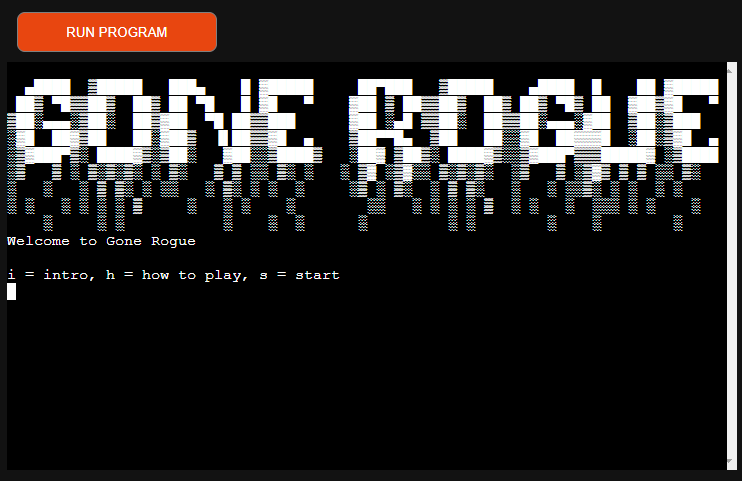  
The title page appears first and presents the main menu.  

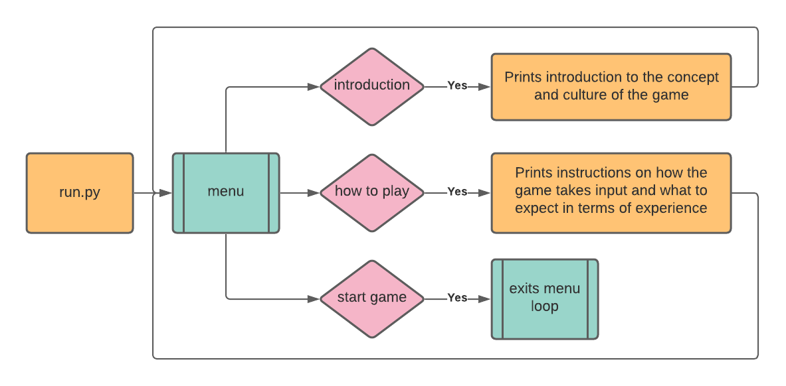  
This logic diagram describes the interaction between the three menu options.  

#### INTRODUCTION
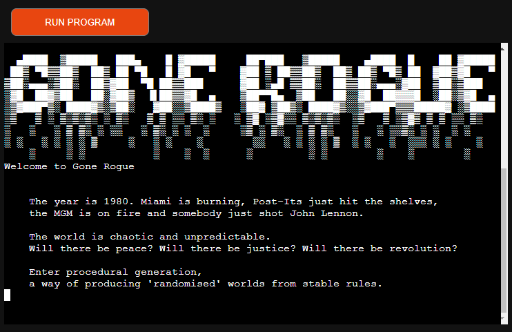  
*N.B. pdf of all screenshots available in /logic-and-screenshots/screenshots  
   
From the introduction, there are some conventions established:
* A **Press Enter** prompt is given to advance the dialogue on the first line
* Upon reaching the end of the dialogue, pressing enter will clear the screen  
It is necessary to establish this as, in order to maintain the style and suspense of the story, it has been deemed necessary to omit the **Press Enter** prompt from all story dialogue.  

#### HOW TO PLAY
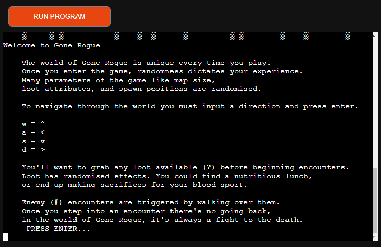 
Another option on the menu screen is the 'how to play' section.  
Unlike most modern games that use event listeners to instantly update the game, *Gone Rogue* relies on string inputs to determine the movement of the hero sprite.  
The 'how to play' section describes how to trigger encounters with all entities on the map.  

#### ENTITY CLASS LOGIC
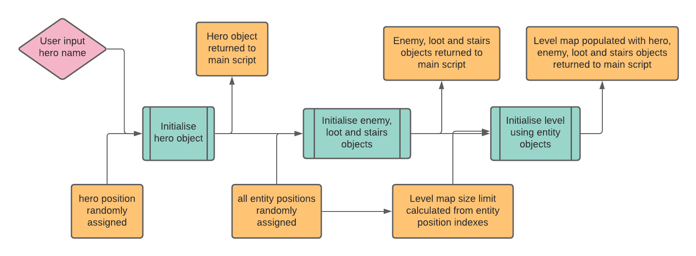  

Entities are initialised by taking randomized data and user data and using the Entity class to generate each entity's attributes.  

#### INPUT HERO NAME
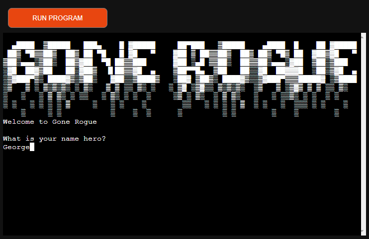  

The user is asked to name their character and the data collected from the input is used in the logic process above to generate the hero object.  

#### LEVEL MAP GENERATION
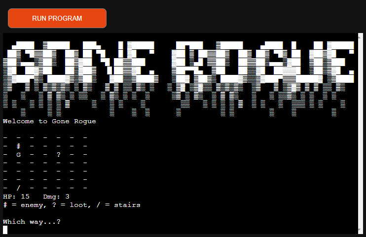  

The level is then generated using the largest number in the entities' randomly generated position attributes. The entities' randomised positional indexes are capped at 6. This was chosen because 10 felt too large to navigate at times and due to the manner in which the user must control the sprite, brevity was prioritised for level size restrictions.  

#### GAME LOOP
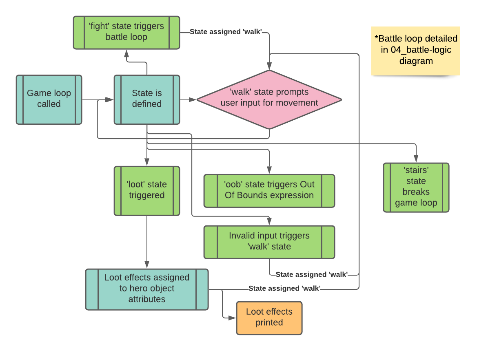  

The game loop is then initiated and a variable called 'state' is used to determine which encounter is appropriate given the hero sprites position and how attributes are updated during gameplay.  
These updates are then passed to the level map print function in the object initialisation logic, which then updates the map and the attribute values beneath it.  

#### LOOT
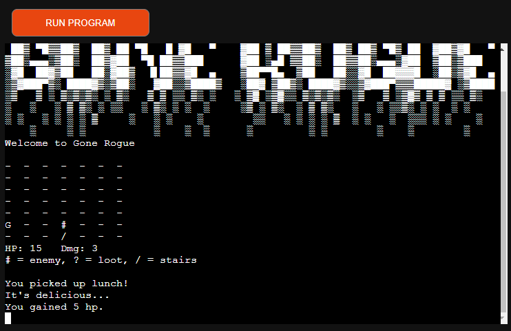  

Unique dialogue is shown for each loot encounter that describes the effect, which is then reflected in the attribute values beneath the map.  

#### BATTLE
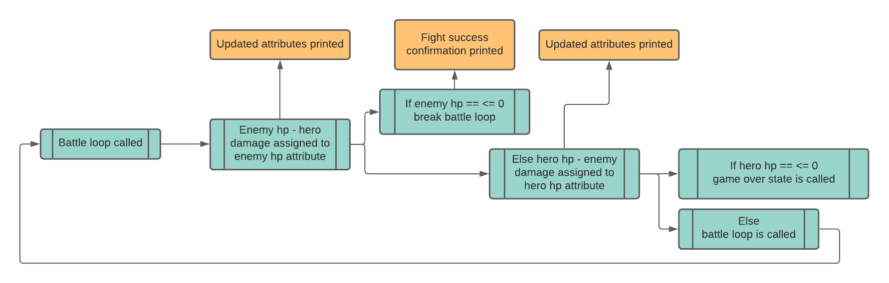  

Battles are automated in *Gone Rogue.* The logic diagram above describes the loop that produces the automated battles.  

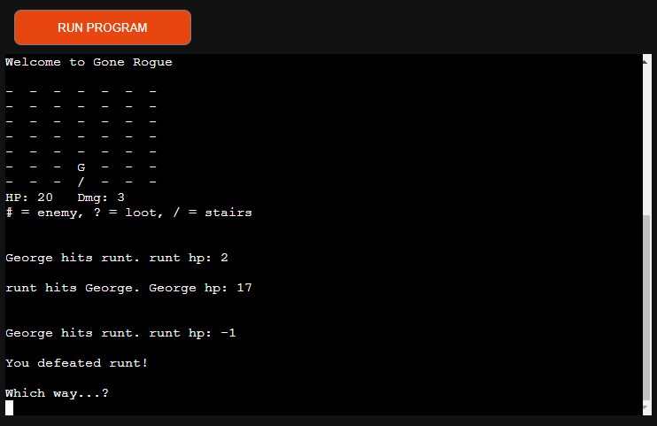  

The results of each exchange are printed beneath the battle.  
Once a battle is won, dialogue confirms the result.  

##### BATTLE LOSS
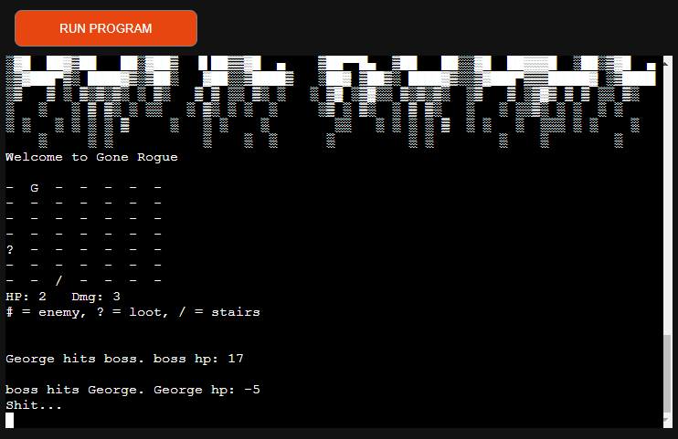  

#### GAME OVER STATE
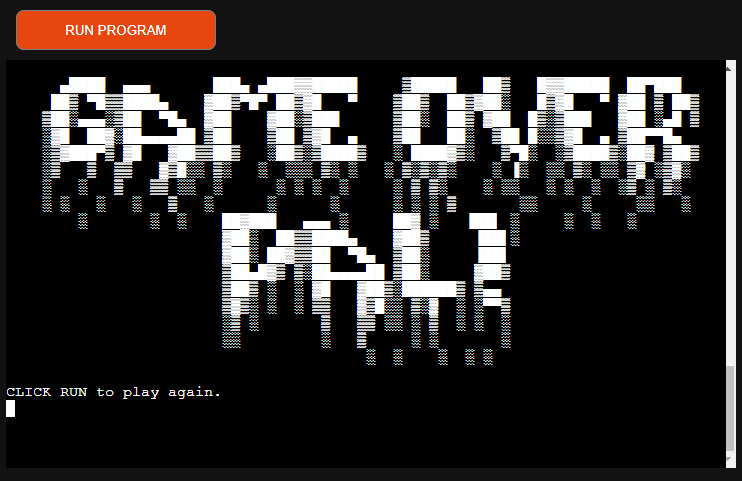  

Should the user fail, the battle loop is interrupted by a 'game over' state.  

#### STAIRS
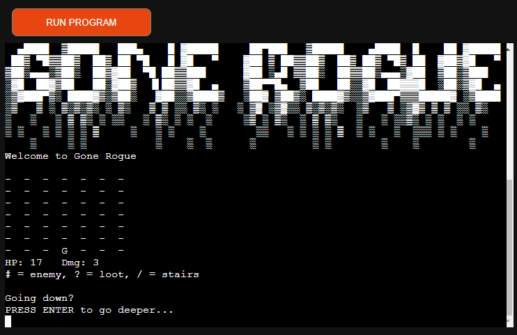  

Stairs are the only entity that can break the game loop.  
Once the game loop is broken, Level 2 is declared.  

#### OOB
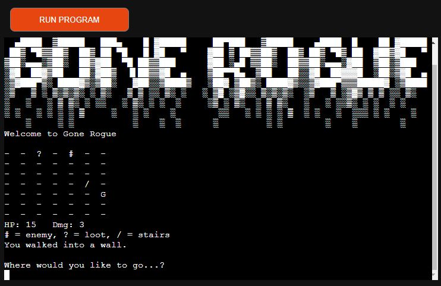  

Should the user try to flee the boundaries of the map, the game reminds them of the consequences.  

#### DATA VALIDATION
  

Data validation ensures that the user knows what actions are available to them.  

#### SUCCESS
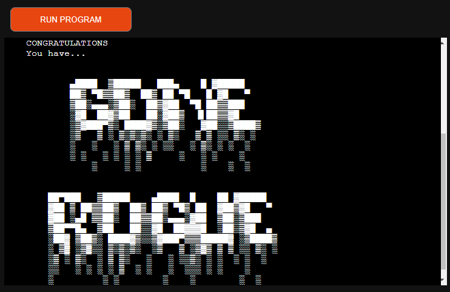  

If the user were to make it through all three levels and defeat the boss, an epilogue is triggered, along with an end title and instructions on how to run the game again.  

#### MAIN SCRIPT LOGIC
The above logic is triggered by the main Python script, run.py:
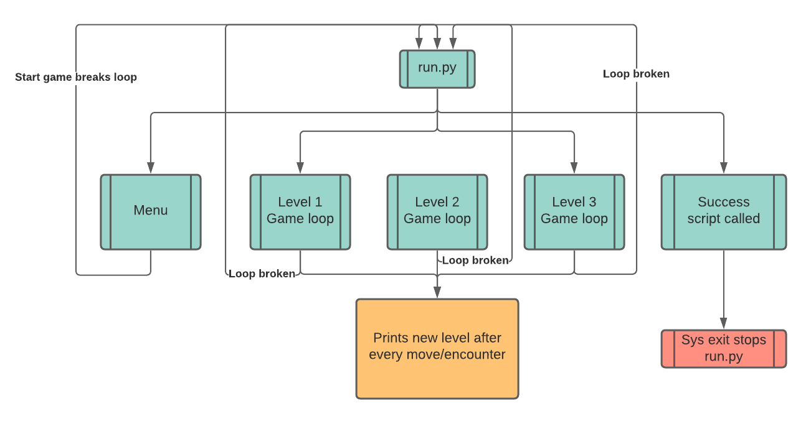  

##### EXTRA DESIGN DECISIONS
Empty inputs will be used to prompt the next line of dialogue.  
Dialogue is indented throughout and any printed action text is left-aligned to distinguish between the two roles for this text-heavy game.  

### SURFACE
The CLI is fairly restrictive on surface design but the CLI is the perfect substrate for this particular homage. The original *Rogue* was played in a command line environment and so the restrictions of CLI can be reframed as a feature in this app.  

## FUTURE FEATURES
There are so many potentials for a game that appears to have many limits.  
As such, the list of future features is vast:
- The game needs an exit function, in case the user wants to start from the beginning
- The choice to not go downstairs? During play testing, there were many occasions when the players would miss a loot item or forget to fight the levels boss and accidentally leave the floor early.  
- Which raises another issue, there is no preventative incentive to stop the user from skipping all enemies and taking all the loot!
- Print level title above map. It would be nice to know which level you're on.
- Clear battle notifications after battle - it's sometimes hard to choose your next move if you and your opponent were evenly matched and there is a screen of battle updates obscuring the map.
- Hp should stop at zero.
- Print enemy HP for level beneath map, so the user can prepare appropriately by taking the loot before entering a losing battle.
- Compass?  C: ^ > v < x		where x means sprite is within one move of a hidden object.
- F to fight and Q to flee.
- A way to cause a freeze state for entities, causing them to miss an attack turn
- Event listeners for movement: full/live WASD compatibility.
- Difficulty: hard lowers hero hp 
	- testing showed that game is well balanced currently at 15hp so more testing needed to determine a fair 'hard' mode. Or just introduce 'impossible' mode.
- Enemy moves (to move enemy closer to hero (needs to account for negative values)).
Note:

    ```
    if (enemy[x]  -hero[x]) > (enemy[y] - hero[y]):
	    enemy[x] += 1
    else:
	    enemy[y] += 1
    ```
- Expand item/enemy pool.
- Background image.

## KNOWN BUGS

- spawn on ents on level 3
- level 2 sometimes creates an input loop on level exit (interaction with stairs)
- level 2 exit sometimes creates input loop
	- entities sometimes spawn under first position on last level 

## FIXED BUGS

- menu glitch
- loot after spawn

## DEPLOYMENT

- create account on heroku.com
- verify account
- create password
- click create a new app
- choose an app name and region
- go to 'settings'
- add buildpacks: 
    - python
    - node.js
- go to 'deploy'
- if you're using github, choose github as your deployment method
- in the 'App connected to GitHub, search and select the app to deploy
- in the 'Automatic Deploys' section, you can choose to set up automatic deployment of any updates to the main branch of your GitHub repository
- you can then click the 'Deploy Branch' button and watch Heroku build your app in the terminal below
- once Heroku has finished this process, it will provide you with a link to the deployed app


## ACKNOWLEDGEMENTS:
Thanks to game testers Sam McGoun and Tom Healey

I read Matt B's Calico Jack src code for inspiration on this project:
os.system('cls' if os.name == 'nt' else 'clear')

clear last line:
https://stackoverflow.com/questions/44565704/how-to-clear-only-last-one-line-in-python-output-console

titles generated at:
https://patorjk.com/software/taag/#p=testall&h=0&v=3&f=Bloody&t=gone%20rogue
